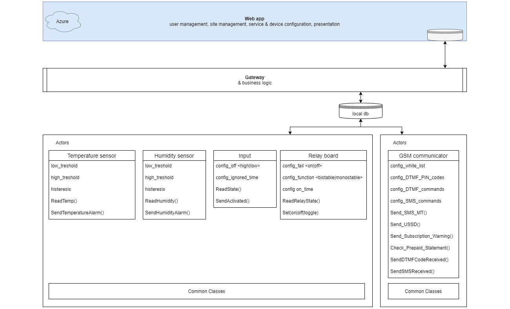

# Home Automation

## In short

The *Home Automation System* is an IoT project. I designed it with intention to make an extension of subsystems, such as alarm system, access control, garden irrigation system, etc. These are very popular among home owners. The *Home Automation System* is designed to integrate the subsystems and take home management and monitoring capabilities to a higher level.  
However, the functionality of the *Home Automation System* implements some features of these subsystems, e.g. the door will be opened not with an RFID card, but via SMS or DTMF codes, or the system inputs can be used to signal an intrusion.  
In each case it is central point of home automation.

## Components

The system consists of physical devices and an application. Management and monitoring is to take place via a web application located in the Azure cloud. Hardware modules are integrated and controlled by the Raspberry Pi microcomputer.

## Project status as of today

- [x] The hardware platform is running  
- [x] The skeleton of the Raspberry Pi application works  
- [x] Electronic modules are integrated: GSM modem, LCD, temoerature sensor, input switches and relay outputs
- [x] Azure and local database (MariaDb) work
- [x] Web application runs on Azure
- [x] Service downloading readings from a temperature sensor stores data in a db on Pi
- [x] Service downloading readings from the IMGW API stores data in a db on Pi
- [x] GSM service initialises GSM modem
- [x] GSM Modem reads test messages sent to it
- [x] Mostly wanted for Christmas: relay board actor for controlling outdoor lights on Christmas tree :grinning: Lights go on on sunset (gathered by API) and go off on time set in appsettings.

## Todo next

- [ ] Finish implementation of different options invoking relays: time, input switch, command from GSM
- [ ] Implement GSM modem functionality. It is tested on side, but not integrated with the *Home Automation System*

As you can see, this is an incipient stage, but the feasibility is already proven and the hardware and core software modules have been integrated. It is a hobby project, which will probably be extended in time, and functionalities will be launched according to the developer's own needs :grinning:

## Technologies used

### Programming languages

- C#
- JavaScript
- HTML/CSS

### Frameworks

- .NET Core with Identity
- .NET Core MVC
- Entity Framework
- Azure Cloud

### OS's

- Windows
- Linux (Debian/Raspbian)

### Databases used

There are two databases. One, local is used to store messages used internally by devices and to store messages routed periodically to/from Azure. It allows system to operate without Internet connecion. Azure is used by web application.

- MariaDb on the Raspberry Pi
- MS SQL on Azure

### Hardware

- Raspberry Pi4 2GB
- GSM module
- Relay module with two relays
- Temperature sensor DS1820
- microswitches for simulating digital inputs
- soil humidity sensor
- LCD 2x16 characters
- i2c bus converter
- SSD (as boot disk)

## Application diagram

The *Home Automation System* consists of web application where users can manage their system and present stored data.  
Another set of apps run on Linux as daemons. They manage devices, synchronise local/Azure data, and implement business logic.

## Development board view

---
If you have questions, visit my [home page](https://www.adameczek.pl "My Homepage") where contact info can be found :smiley:
